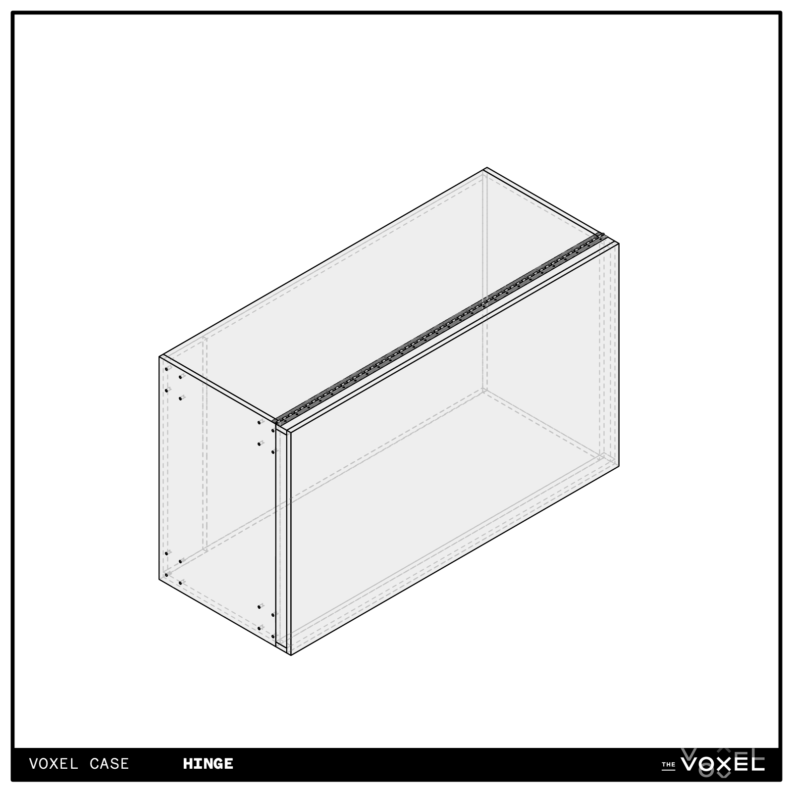
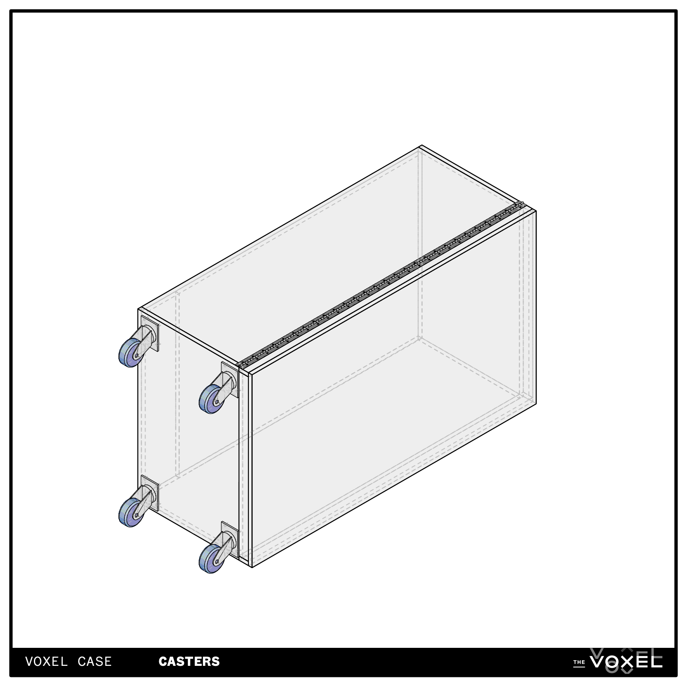
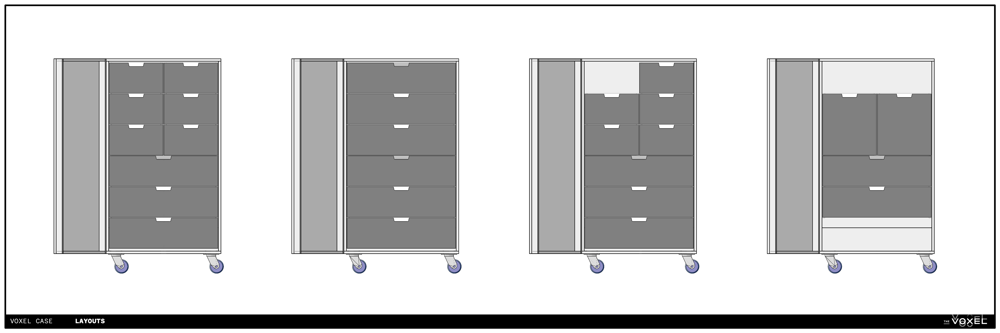

# voxel-case
The Voxel Case is our cable and equipment storage solution at The Voxel Theater in Baltimore, MD. We designed the cases with four goals in mind:
- **Modular.** As we grow, our inventory will grow. Changing should be easy.
- **Intuitive.** Guest artists should be able to easily find what they need.
- **Tidy.** We regularly host guests and classes, so we want the theater to look nice.
- **Inexpensive.**

We centered the design on the [IKEA NORDLI](https://www.ikea.com/us/en/search/products/?q=Nordli&f-colors=10028&f-subcategories=st004) modular chest-of-drawers system. We then designed an inexpensive plywood box with casters to surround them.

Using a modular system means drawers can be swapped without modifying the case itself. Though the drawers are mass produced, we’ve been using them for more than a year and have not experienced any failures. We think they look pretty sharp!

One Voxel Case costs around $650, including all hardware.

- [The Plywood Box](#the-plywood-box)
- [Paint](#paint)
- [Assemble](#assemble)
- [The Drawers](#the-drawers)
- [Shopping List](#shopping-list)

---

## The Plywood Box
The box can be made from two 4x8 sheets of 23/32” (common ¾”) plywood. We chose sanded Birch plywood because we like the finish.

|   | Cut List (for 23/32” stock) |   |
| - | --------------------------- | - |
| 2 | 2'-9 1/16" x 1’-8” | Top/Bottom |
| 2 | 4'-6 3/4" x 1’-8” | Top/Bottom |
| 1 | 4’ x 2’-7 ⅝” | Back piece 1 |
| 1 | 6 ¾” x 2’-7 ⅝” | Back piece 2 |
| 2 | 1’-0” x 2” | Bottom Spacers |
| 1 | 4’-8 3/16” x 2’-9 1/16” | Door Front |
| 2 | 4’-8 3/16”x 1 ⅞” | Door Sides |
| 2 | 2’-7 ⅝” x 1 ⅞” | Door Top/Bottom |

### Sheet Layout

### Latch Cutouts
Cut out notches for latches as indicated. These measurements are for [Medium Recessed Latches](https://www.reliablehardware.com/mediumrecessedlatchblack.aspx) from Reliable Hardware, and will need to be adjusted if you use different latches.

Alternatively, the notches can be routed out to a depth of .55” instead of cut out completely.

### Caster bolt holes
Drill 5/16” holes for 5/16” x 1-¼” carriage bolts. This pattern ensures that there’s space for the heads of the carriage bolts on the inside.

---

## Paint

Now’s the time to paint it. We gave it a base coat of dark muck paint, then black latex, and finally a clear seal coat for durability. We also painted a name for each case on the side, so you can tell what’s in it.

We also left the inside of the lid unpainted.

---

## Assemble

Assemble the case as shown using your preferred fasteners. We opted to use glue and screws.

**Pay close attention to which pieces cap the others!**

Cut the piano hinge to 4’-8”. Temporarily clamp the front to the case, line it up, and screw in the hinge between the two halves.

Then bolt on the casters using (16) 5/16” x 1-¼” carriage bolts, (16) nuts, and (16) 5/16” washers.

---

## The Drawers
There’s five different drawer modules that can be mixed together. Each drawer unit has one or two mounting holes at the top.

The case is slightly wider than the drawer units- you may wish to shim the 1/8" space on the left and right sides. Once the module is in place, drill a hole through the back of the case and bolt the module in using 5/16” x 2-¾” carriage bolts, nuts, and washers.

For added durability, use wood glue when assembling the drawers.

---

# Shopping List

| Component | Each | Quantity | Total | Link |
| --------- | ---- | -------- | ----- | ---- |
| Plywood Sheet | $85 | 2 | $170 | Local Lumber Supplier| 
| Road Case Latches | $8.80 | 1 | $8.80 | https://www.reliablehardware.com/mediumrecessedlatchblack.aspx | 
| 4” Casters | $19.47 | 4 | $77.88 | https://www.bmisupply.com/ProductDetail/064240SXK |
| 6’ Black Piano Hinge | $21.37 | 1 | $21.37 | https://www.mcmaster.com/1904A82-1904A29/ |
| Hinge Screws (100pk, makes 1 case) | $7.05 | 1 | $7.05 | https://www.mcmaster.com/91555A114/ |
| Caster Bolts (50pk, makes 3 cases) | $8.24 | 1 | $8.24 | https://www.mcmaster.com/93604A643/ |
| Caster Nuts (100pk, makes 6 cases) | $6.97 | 1 | $6.97 | https://www.mcmaster.com/90371A019/ |
| Caster Washers (50pk, makes 3 cases) | $9.91 | 1 | $9.91 | https://www.mcmaster.com/90850A150/ |
| Module Bolts (10pk, makes 2 cases) | $10.79 | 1 | $10.79 | https://www.mcmaster.com/90185A420/ |
| 1-⅝” Drywall Screws | $8.22 | 1 | $8.22 | https://www.mcmaster.com/90095A416/ |
| ¾” Drywall Screws | $6.69 | 1 | $6.69 | https://www.mcmaster.com/90031A151/ |

| NORDLI Component | Each | Link |
| ---------------- | ---- | ---- |
|  | $70 | https://www.ikea.com/us/en/p/nordli-modular-2-drawer-chest-anthracite-20365857/ |
|  | $140 | https://www.ikea.com/us/en/p/nordli-modular-3-drawer-chest-anthracite-00365943/ |
|  | $60 | https://www.ikea.com/us/en/p/nordli-modular-2-drawer-chest-anthracite-70473166/ |
|  | $90 | https://www.ikea.com/us/en/p/nordli-modular-3-drawer-chest-anthracite-30473168/ |
|  | $60 | https://www.ikea.com/us/en/p/nordli-modular-chest-anthracite-90473170/ |

