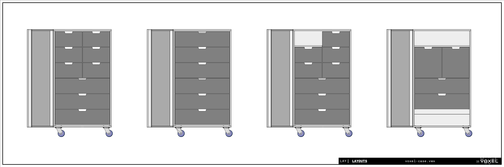

# voxel-case

The Voxel Case is our cable and equipment storage solution at The Voxel Theater in Baltimore, MD. We designed the cases with four goals in mind:
- **Modular.** As we grow, our inventory will grow. Changing should be easy.
- **Intuitive.** Guest artists should be able to easily find what they need.
- **Tidy.** We regularly host guests and classes, so we want the theater to look nice.
- **Inexpensive.**

We centered the design on the [IKEA NORDLI](https://www.ikea.com/us/en/search/products/?q=Nordli&f-colors=10028&f-subcategories=st004) modular chest-of-drawers system. We then designed a light-duty castered enclosure. Though they aren't quite robust enough to go out on tour, they work great rolling around our theater.

Using a modular system means drawers can be swapped without modifying the case itself. We think they look pretty sharp!

One Voxel Case costs around $650, including all hardware.

- [Build Instructions](#voxel-case)
  - [Prepare Materials](#prepare-materials)
  - [Paint](#paint)
  - [Assemble](#assemble)
  - [Drawers](#drawers)
- [Shopping List](shopping-list.md)
- [Accessories](accessories.md)

---

## Prepare Materials
The box can be made from two 4x8 sheets of 23/32” (common ¾”) plywood. We chose sanded Birch plywood because we like the finish.

|   | Cut List (for 23/32” stock) |   |
| - | --------------------------- | - |
| 2 | `2'-9 1/16"` x `1’-8”` | Top/Bottom |
| 2 | `4'-6 3/4"` x `1’-8”` | Sides |
| 1 | `4’` x `2’-7 ⅝”` | Back piece 1 |
| 1 | `6 ¾”` x `2’-7 ⅝”` | Back piece 2 |
| 2 | `1’-0”` x `2”` | Bottom Spacers |
| 1 | `4’-8 3/16”` x `2’-9 1/16”` | Door Front |
| 2 | `4’-8 3/16”` x `1 ⅞”` | Door Sides |
| 2 | `2’-7 ⅝”` x `1 ⅞”` | Door Top/Bottom |

### Sheet Layout

----

### Latch Cutouts
Cut out notches for latches as indicated. These measurements are for [Medium Recessed Latches](https://www.reliablehardware.com/mediumrecessedlatchblack.aspx) from Reliable Hardware, and will need to be adjusted if you use different latches.

Alternatively, the notches can be routed out to a depth of `5/8”` instead of cut out completely.

---

### Caster bolt holes
Drill `5/16”` holes for `5/16” x 1-¼”` carriage bolts. This pattern ensures that there’s space for the heads of the carriage bolts on the inside.

  

-----

## Paint

Now’s the time to paint it. We gave it a base coat of dark muck paint, then black latex, and finally a clear seal coat for durability. We also painted a name for each case on the side, so you can tell what’s in it.

We also left the inside of the lid unpainted, to make the [accessories](accessories.md) easier to see.

---

## Assemble

Assemble the case as shown using your preferred fasteners. We opted to use glue and screws.

**Pay close attention to which pieces cap the others!**

Cut the piano hinge to `4’-8”`. Temporarily clamp the front to the case, line it up, and screw in the hinge between the two halves.

Then bolt on the casters using (16) `5/16” x 1-¼” carriage bolts`, (16) `5/16” nuts`, and (16) `5/16” washers`.

Finally, screw in the two bottom spacers. They should be against the outside of the box and not obstruct the caster bolts.

---

## Drawers
There’s five different [NORDLI drawer modules](shopping-list.md#nordli-modules) that can be mixed together. Each unit has one or two mounting holes in the back.

The case is slightly wider than the drawer units- you may wish to shim the 1/8" space on the left and right sides. Once the module is in place, drill a 5/16" hole through the back of the case, using the factory hole in the NORDLI unit as a guide.

Bolt the module down using `5/16” x 2-¾” carriage bolts`, `5/16” nuts`, and `5/16” washers`, with the head of the bolt on the outside of the case.

For added durability, use wood glue when assembling the drawers!

